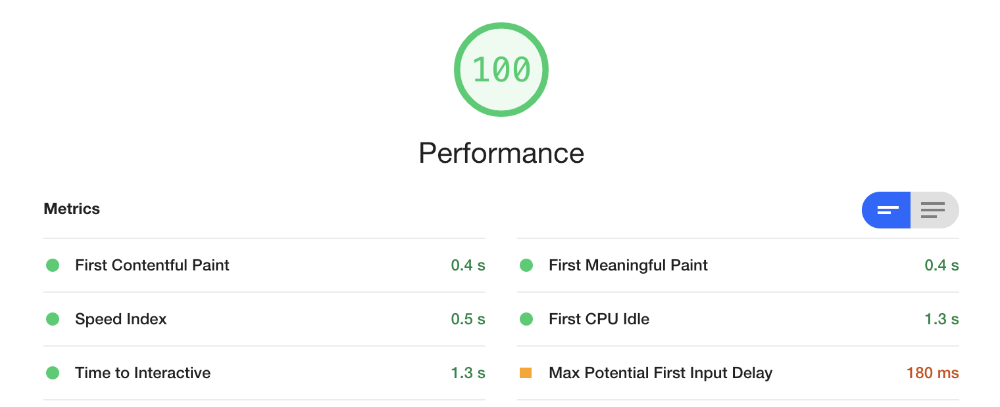
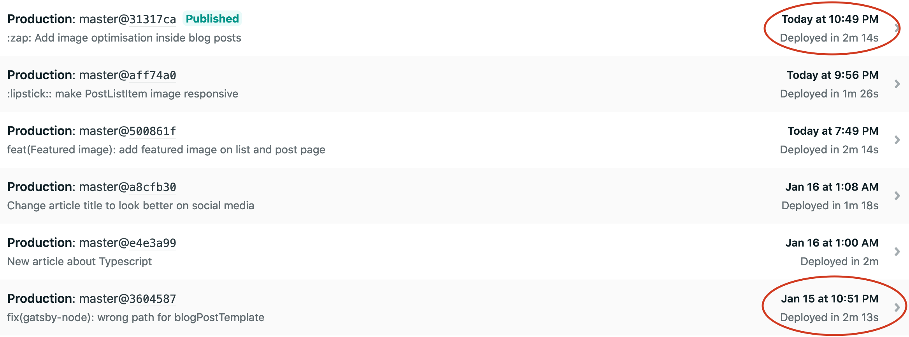

There's nothing much to say about [gatsby-image](https://www.gatsbyjs.org/docs/gatsby-image/) pluging. Starting from a markdown blog, I just followed the few steps described in [Gatsby's documentation](https://www.gatsbyjs.org/docs/using-gatsby-image/) to install a few plugins and I got optimized imaged in my blog posts (did I told already told you how detailed this doc is ?...🥰)

Gatsby-image API does not only compress images and creates lazy loading miniatures, but it also gives you access to function to crop and edit the image. For instance the post banners on the blog pages are all 680x400px whithout beeing cropped with an external software like Photoshop.

## Performances

Thanks to those optimized images, this blog reached a perfect score at Lightroom audit.
Here is the performance report for the homepage 😎

However, one can wonder if the image optimization makes the build time spikes. Thanks to Netlify, all builds are tracked. I compared before and after I added gatsby-image and as you can see in the screenshot, there's no difference.

The fact that the blog is very tiny might explain those results. However, even if the build time would have doubled or tripled, the gain in term of UX is so important it totally worth it.
